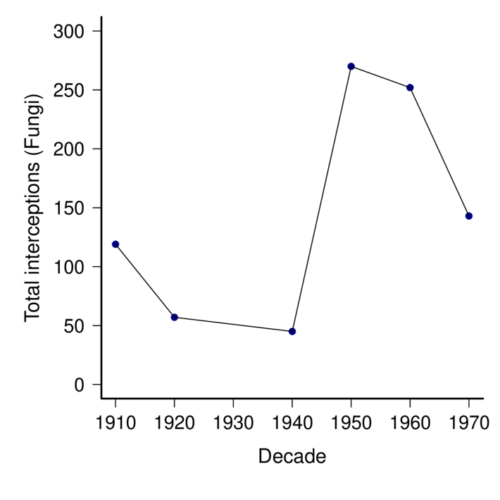
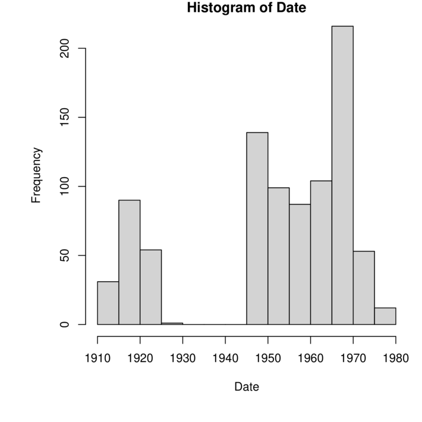

This is a very first cut of the fungal interceptions data. It's pretty clean, but there are likely still issues with synonomy. Some have been detected and fixed already but I haven't systematically gone through to see how thorough that is.  There is a lot more that could be done (even with these data) but including and comparing with data from the 1980- would add a lot for sure.
==================================

Edited: JGarnas_2024.01.13

 # By kingdom and decade of interception

## So, WAY more arthropods.  only 231 total fungal detections. Consider whether this is enough to do anything with.  Perhaps the story is that visual inspection is sorely inadequate.

  |      |
  | :--- |

  |          |    | Actinobacteriota| Annelida| Arthropoda| Ascomycota| Basidiomycota| Chordata| Foraminifera| Mollusca| Nematoda| Oomycota| Proteobacteria| Tracheophyta|
  |:---------|---:|----------------:|--------:|----------:|----------:|-------------:|--------:|------------:|--------:|--------:|--------:|--------------:|------------:|
  |          | 278|                0|        0|          0|          0|             0|        0|            0|        0|        0|        0|              0|            0|
  |Animalia  |   7|                0|        4|       2822|          0|             0|        1|            0|       55|       14|        0|              0|            0|
  |Bacteria  |   5|                1|        0|          0|          0|             0|        0|            0|        0|        0|        0|              1|            0|
  |Chromista |   0|                0|        0|          0|          0|             0|        0|            1|        0|        0|        2|              0|            0|
  |Fungi     |   0|                0|        0|          0|        221|            10|        0|            0|        0|        0|        0|              0|            0|
  |Plantae   |   0|                0|        0|          0|          0|             0|        0|            0|        0|        0|        0|              0|            5|

  # By kingdom and phylum

  |                 |    | Animalia| Bacteria| Chromista| Fungi| Plantae|
  |:----------------|---:|--------:|--------:|---------:|-----:|-------:|
  |                 | 278|        7|        5|         0|     0|       0|
  |Actinobacteriota |   0|        0|        1|         0|     0|       0|
  |Annelida         |   0|        4|        0|         0|     0|       0|
  |Arthropoda       |   0|     2822|        0|         0|     0|       0|
  |Ascomycota       |   0|        0|        0|         0|   221|       0|
  |Basidiomycota    |   0|        0|        0|         0|    10|       0|
  |Chordata         |   0|        1|        0|         0|     0|       0|
  |Foraminifera     |   0|        0|        0|         1|     0|       0|
  |Mollusca         |   0|       55|        0|         0|     0|       0|
  |Nematoda         |   0|       14|        0|         0|     0|       0|
  |Oomycota         |   0|        0|        0|         2|     0|       0|
  |Proteobacteria   |   0|        0|        1|         0|     0|       0|
  |Tracheophyta     |   0|        0|        0|         0|     0|       5|

  

# By kingdom and decade of interception

### What's up with the missing decades for fungi?  Great Depression/WWII impacts on inspection, or just vagaries of reporting?

  | Kingdom/Decade | 1910 | 1920 | 1930 | 1940 | 1950 | 1960 | 1970 |  1980 |
  | :------------- | ---: | ---: | ---: | ---: | ---: | ---: | ---: | ----: |
  | z_Not listed   |    1 |    2 |    3 |    8 |   10 |    4 |   12 |     7 |
  | Animalia       |  306 | 3439 | 2237 | 2392 | 3376 | 4894 | 6658 | 11885 |
  | Bacteria       |   35 |  243 |    4 |    0 |    0 |    0 |    0 |     0 |
  | Chromista      |    0 |    0 |    0 |    0 |    3 |    2 |    0 |     0 |
  | Fungi          |   18 |  157 |    1 |    0 |  209 |  220 |  261 |    20 |
  | Plantae        |    0 |    5 |    0 |    0 |    1 |    0 |    0 |     6 |

  

​    

  # **FUNGI only from here**

  - nearly all ascomycota (where most plant pathogens sit).
  - At first look there are some pathogen groups listed, though I still have to look at species. 
  - Even at the genus level, detections are low and sporadic.

|                                                 | 1910| 1920| 1940| 1950| 1960| 1970|
|:------------------------------------------------|----:|----:|----:|----:|----:|----:|
|Ascomycota, , Achorella                          |    0|    0|    0|    1|    0|    0|
|Ascomycota, , Acremoniella                       |    1|    0|    0|    0|    0|    0|
|Ascomycota, , Ascochyta                          |    0|    0|    0|    1|    0|    0|
|Ascomycota, , Bactridium                         |    0|    1|    0|    0|    0|    0|
|Ascomycota, , Botryodiplodia                     |    0|    1|    0|    0|    0|    0|
|Ascomycota, , Camarosporium                      |    0|    0|    0|    1|    3|    1|
|Ascomycota, , Cephalosporium                     |    1|    2|    0|    0|    0|    0|
|Ascomycota, , Cephalothecium                     |    2|    2|    0|    0|    0|    0|
|Ascomycota, , Chaetodiplodia                     |    3|    0|    0|    0|    0|    0|
|Ascomycota, Apiosporaceae, Apiospora             |    0|    0|    0|    2|    1|    0|
|Ascomycota, Apiosporaceae, Arthrinium            |    0|    0|    0|    1|    0|    1|
|Ascomycota, Aspergillaceae, Aspergillus          |   28|   11|    0|    1|    0|    0|
|Ascomycota, Asterinaceae, Asterina               |    0|    0|    0|    1|    0|    0|
|Ascomycota, Botryosphaeriaceae, Botryosphaeria   |    0|    0|    0|    1|    2|    0|
|Ascomycota, Botryosphaeriaceae, Microdiplodia    |    0|    0|    0|    0|    1|    0|
|Ascomycota, Botryosphaeriaceae, Neofusicoccum    |    0|    0|    1|    4|    0|    0|
|Ascomycota, Calcarisporiaceae, Calcarisporium    |    0|    0|    0|    0|    1|    0|
|Ascomycota, Ceratocystidaceae, Ceratocystis      |    0|    0|    0|    0|    2|    0|
|Ascomycota, Ceratocystidaceae, Chalaropsis       |    0|    0|    0|    1|    0|    0|
|Ascomycota, Ceratocystidaceae, Endoconidiophora  |    0|    0|    0|    0|    1|    0|
|Ascomycota, Ceratocystidaceae, Thielaviopsis     |    0|    0|    0|    0|    1|    0|
|Ascomycota, Chaetomiaceae, Chaetomium            |    5|    1|    1|    0|    0|    0|
|Ascomycota, Chaetosphaeriaceae, Pseudolachnella  |    0|    0|    0|    0|    1|    0|
|Ascomycota, Clavicipitaceae, Aschersonia         |    0|    0|    0|    1|    0|    0|
|Ascomycota, Clavicipitaceae, Hypocrella          |    0|    0|    0|    1|    0|    0|
|Ascomycota, Coryneliaceae, Caliciopsis           |    0|    0|    0|    0|    0|    2|
|Ascomycota, Diaporthaceae, Phomopsis             |    0|    0|    0|    0|    6|    0|
|Ascomycota, Didymellaceae, Ascochyta             |    2|    0|    2|    7|   39|   21|
|Ascomycota, Didymellaceae, Boeremia              |    0|    0|    0|    0|    1|    0|
|Ascomycota, Didymellaceae, Cerebella             |    0|    1|    0|    0|    0|    0|
|Ascomycota, Didymellaceae, Didymella             |    0|    0|    3|   16|    4|    0|
|Ascomycota, Didymellaceae, Epicoccum             |    0|    0|    0|   12|    0|    0|
|Ascomycota, Didymellaceae, Stagonosporopsis      |    0|    0|    0|    1|    0|    0|
|Ascomycota, Hypocreaceae, Acrostalagmus          |    2|    4|    0|    0|    0|    0|
|Ascomycota, Melanconidaceae, Prosthecium         |    0|    0|    0|    1|    0|    0|
|Ascomycota, Melanommataceae, Camposporium        |    0|    0|    0|    0|    1|    0|
|Ascomycota, Meliolaceae, Amazonia                |    0|    0|    0|    0|    0|    1|
|Ascomycota, Micropeltidaceae, Chaetothyrina      |    0|    0|    0|    0|   15|   31|
|Ascomycota, Microthyriaceae, Asterinella         |    0|    0|    0|    1|    0|    0|
|Ascomycota, Microthyriaceae, Maublancia          |    0|    0|    0|    1|    0|    0|
|Ascomycota, Mycosphaerellaceae, Asperisporium    |    0|    0|    0|    5|    0|    0|
|Ascomycota, Mycosphaerellaceae, Cercospora       |    1|    0|    3|   20|   55|   42|
|Ascomycota, Mycosphaerellaceae, Cercosporella    |    0|    0|    0|    1|    2|    0|
|Ascomycota, Mycosphaerellaceae, Chuppomyces      |    0|    0|    3|    7|    0|    0|
|Ascomycota, Mycosphaerellaceae, Clarohilum       |    0|    0|    0|    1|    0|    0|
|Ascomycota, Mycosphaerellaceae, Mycosphaerella   |    0|    0|   17|   48|    0|    1|
|Ascomycota, Mycosphaerellaceae, Nothopassalora   |    0|    0|    0|    1|    0|    0|
|Ascomycota, Mycosphaerellaceae, Passalora        |    5|    0|    0|    5|   10|    0|
|Ascomycota, Mycosphaerellaceae, Pluripassalora   |    0|    0|    0|    0|    4|    0|
|Ascomycota, Mycosphaerellaceae, Pseudocercospora |    0|    0|    3|   43|   55|   14|
|Ascomycota, Mycosphaerellaceae, Rosisphaerella   |    0|    0|    0|    2|    0|    0|
|Ascomycota, Mycosphaerellaceae, Scolecostigmina  |    0|    0|    0|    2|    4|    0|
|Ascomycota, Mycosphaerellaceae, Sphaerulina      |    0|    0|    1|    2|    0|    0|
|Ascomycota, Myrotheciomycetaceae, Trichothecium  |    2|    7|    0|    0|    0|    0|
|Ascomycota, Nectriaceae, Allantonectria          |    0|    0|    0|    1|    0|    0|
|Ascomycota, Ophiostomataceae, Ophiostoma         |    0|    0|    0|    0|    1|    1|
|Ascomycota, Ophiostomataceae, Sporothrix         |    0|    0|    0|    3|    0|    0|
|Ascomycota, Orbiliaceae, Arthrobotrys            |    0|    0|    0|    1|    0|    0|
|Ascomycota, Phacidiaceae, Allantophomopsis       |    0|    0|    0|    1|    0|    0|
|Ascomycota, Phaeochoraceae, Phaeochoropsis       |    0|    0|    0|    2|    1|    0|
|Ascomycota, Phyllachoraceae, Coccodiella         |    0|    0|    0|    0|    2|    0|
|Ascomycota, Phyllachoraceae, Coccostromopsis     |    0|    0|    0|    1|    0|    0|
|Ascomycota, Pleosporaceae, Alternaria            |   12|    1|    2|   28|    8|    0|
|Ascomycota, Sclerotiniaceae, Botryotinia         |   13|    0|    0|   15|    1|    0|
|Ascomycota, Sclerotiniaceae, Botrytis            |   41|   24|    9|   21|    0|    0|
|Ascomycota, Seuratiaceae, Seuratia               |    0|    0|    0|    1|    0|    0|
|Ascomycota, Trichosphaeriaceae, Nigrospora       |    1|    1|    0|    0|    0|    0|
|Ascomycota, Venturiaceae, Coleroa                |    0|    0|    0|    0|    5|    0|
|Ascomycota, Xylariaceae, Anthostomella           |    0|    0|    0|    2|    1|    0|
|Basidiomycota, , Aecidium                        |    0|    0|    0|    0|    2|    1|
|Basidiomycota, Chaconiaceae, Chaconia            |    0|    0|    0|    0|    1|    2|
|Basidiomycota, Phakopsoraceae, Bubakia           |    0|    0|    0|    0|   13|   12|
|Basidiomycota, Phakopsoraceae, Cerotelium        |    0|    1|    0|    1|    8|   13|
|Basidiomycota, Phakopsoraceae, Phakopsora        |    0|    0|    0|    1|    0|    0|
|                                                  |      |      |      |      |      |      |
|                                                  |||||||

  #  total_interceptions_fungi
  **Caption:** 

  

  ###### 01_total_interceptions_fungi.pdf
  ### Script file: 
  ./interceptions_amyric/01_dataImport.r
  Timestamp:  Fri Dec 22 09:27:15 2023 

  Notes: 
  ------------------------------
 02_mean_annual_interceptions_fungi.pdf.annot.md.annot.md
==================================

  #  mean_annual_interceptions_fungi
  **Caption:** 

  

  ###### 02_mean_annual_interceptions_fungi.pdf
  ### Script file: 
  ./interceptions_amyric/01_dataImport.r
  Timestamp:  Fri Dec 22 09:53:01 2023 

  Notes: 
  ------------------------------

#  histogram_by_year
**Caption:** 

###### 03_histogram_by_year.pdf
## Just a few more graphs/tables -- this is all preliminary
------------------------------

#  Cumulative detections, all fungi

**Caption:** 

###### 04_cumulativedetections_fungi.pdf

# Detections by decade and country: 
------------------------------

## Sorted by ALLDECADES

| Origin                              | 1910 | 1920 | 1940 | 1950 | 1960 | 1970 | alldecades |
| :---------------------------------- | ---: | ---: | ---: | ---: | ---: | ---: | ---------: |
| Mexico                              |    1 |    2 |    7 |   79 |   41 |   15 |        145 |
| Netherlands                         |   30 |   15 |    2 |   19 |    1 |    0 |         67 |
| Japan                               |    3 |    2 |    6 |   29 |   18 |    8 |         66 |
| Colombia                            |    5 |    1 |    1 |    6 |   24 |   13 |         50 |
| Ecuador                             |    7 |    1 |    1 |    4 |    9 |    6 |         28 |
| Guatemala                           |    4 |    1 |    1 |    5 |   10 |    6 |         27 |
| Panama                              |    0 |    1 |    2 |    8 |   13 |    2 |         26 |
| Dominican Republic                  |    0 |    0 |    1 |    2 |   12 |   10 |         25 |
| Brazil                              |    7 |    0 |    2 |    5 |    4 |    5 |         23 |
| France                              |    6 |    7 |    1 |    4 |    4 |    0 |         22 |
| Puerto Rico                         |    4 |    0 |    1 |    8 |    7 |    2 |         22 |
| UK                                  |    8 |    5 |    0 |    4 |    4 |    0 |         21 |
| Italy                               |    0 |    1 |    2 |   10 |    7 |    0 |         20 |
|  Unknown |    0 |    0 |    0 |    2 |    7 |    9 |         18 |
| Peru                                |    1 |    0 |    1 |    3 |    4 |    8 |         17 |
| Australia                           |    1 |    0 |    1 |    8 |    5 |    1 |         16 |
| Jamaica                             |    0 |    0 |    0 |    1 |   10 |    5 |         16 |
| South Africa                        |    0 |    5 |    0 |    6 |    5 |    0 |         16 |
| China                               |    7 |    1 |    2 |    3 |    0 |    0 |         13 |
| Costa Rica                          |    0 |    0 |    1 |    6 |    4 |    2 |         13 |
| El Salvador                         |    0 |    0 |    0 |    3 |    4 |    6 |         13 |
| Belgium                             |    4 |    1 |    2 |    4 |    0 |    0 |         11 |
| Venezuela                           |    1 |    0 |    0 |    3 |    3 |    4 |         11 |
| Argentina                           |    6 |    0 |    1 |    2 |    1 |    0 |         10 |
| Honduras                            |    0 |    0 |    1 |    4 |    3 |    2 |         10 |
| Haiti                               |    0 |    0 |    1 |    1 |    5 |    2 |          9 |
| Trinidad & Tobago                   |    1 |    0 |    0 |    2 |    2 |    3 |          8 |
| Bolivia                             |    0 |    0 |    0 |    0 |    4 |    3 |          7 |
| Cuba                                |    2 |    1 |    1 |    3 |    0 |    0 |          7 |
| Germany                             |    1 |    0 |    0 |    3 |    2 |    0 |          6 |
| New Zealand                         |    2 |    0 |    0 |    2 |    0 |    2 |          6 |
| Philippines                         |    2 |    1 |    0 |    0 |    2 |    1 |          6 |
| Spain                               |    2 |    0 |    0 |    1 |    2 |    1 |          6 |
| Bermuda                             |    0 |    0 |    1 |    4 |    0 |    0 |          5 |
| Hong Kong                           |    0 |    0 |    0 |    0 |    2 |    3 |          5 |
| India                               |    1 |    1 |    1 |    1 |    1 |    0 |          5 |
| Indonesia                           |    2 |    0 |    0 |    0 |    3 |    0 |          5 |
| Nicaragua                           |    0 |    0 |    0 |    0 |    1 |    4 |          5 |
| Africa                              |    0 |    3 |    0 |    0 |    0 |    1 |          4 |
| Barbados                            |    0 |    0 |    0 |    0 |    2 |    2 |          4 |
| Canada                              |    1 |    0 |    0 |    1 |    2 |    0 |          4 |
| Chile                               |    0 |    2 |    0 |    0 |    2 |    0 |          4 |
| Martinique                          |    0 |    0 |    1 |    1 |    1 |    1 |          4 |
| Portugal                            |    0 |    0 |    0 |    2 |    0 |    2 |          4 |
| Austria                             |    0 |    0 |    0 |    2 |    0 |    1 |          3 |
| Bahamas                             |    0 |    0 |    0 |    0 |    3 |    0 |          3 |
| Cape Verde                          |    1 |    2 |    0 |    0 |    0 |    0 |          3 |
| Greece                              |    0 |    0 |    0 |    1 |    1 |    1 |          3 |
| Grenada                             |    0 |    0 |    1 |    1 |    0 |    1 |          3 |
| Lebanon                             |    0 |    0 |    0 |    1 |    0 |    2 |          3 |
| St. Kitts & Nevis                   |    0 |    0 |    0 |    0 |    1 |    2 |          3 |
| St. Lucia                           |    0 |    0 |    0 |    0 |    1 |    2 |          3 |
| Taiwan                              |    0 |    0 |    0 |    0 |    3 |    0 |          3 |
| Angola                              |    0 |    0 |    0 |    2 |    0 |    0 |          2 |
| Antigua & Barbuda                   |    0 |    0 |    0 |    1 |    0 |    1 |          2 |
| Azores                              |    0 |    0 |    1 |    1 |    0 |    0 |          2 |
| Denmark                             |    0 |    0 |    0 |    1 |    1 |    0 |          2 |
| French Polynesia                    |    2 |    0 |    0 |    0 |    0 |    0 |          2 |
| Hawaii                              |    0 |    1 |    0 |    0 |    1 |    0 |          2 |
| Kenya                               |    0 |    0 |    0 |    2 |    0 |    0 |          2 |
| Nigeria                             |    0 |    0 |    0 |    2 |    0 |    0 |          2 |
| Papua New Guinea                    |    0 |    0 |    0 |    0 |    2 |    0 |          2 |
| Russia                              |    0 |    0 |    0 |    1 |    1 |    0 |          2 |
| Sint Maarten                        |    0 |    0 |    0 |    0 |    1 |    1 |          2 |
| Slovenia                            |    0 |    0 |    0 |    2 |    0 |    0 |          2 |
| Turkey                              |    0 |    0 |    1 |    1 |    0 |    0 |          2 |
| U.S. Virgin Islands                 |    2 |    0 |    0 |    0 |    0 |    0 |          2 |
| Vietnam                             |    0 |    0 |    0 |    0 |    2 |    0 |          2 |
| American Samoa                      |    1 |    0 |    0 |    0 |    0 |    0 |          1 |
| Cayman Islands                      |    0 |    0 |    0 |    1 |    0 |    0 |          1 |
| Central America                     |    0 |    1 |    0 |    0 |    0 |    0 |          1 |
| Europe                              |    0 |    0 |    0 |    0 |    1 |    0 |          1 |
| Fiji                                |    0 |    0 |    1 |    0 |    0 |    0 |          1 |
| Guadeloupe                          |    0 |    0 |    0 |    0 |    0 |    1 |          1 |
| Guyana                              |    1 |    0 |    0 |    0 |    0 |    0 |          1 |
| Hungary                             |    1 |    0 |    0 |    0 |    0 |    0 |          1 |
| Ireland                             |    0 |    1 |    0 |    0 |    0 |    0 |          1 |
| Israel                              |    0 |    0 |    0 |    0 |    1 |    0 |          1 |
| Laos                                |    0 |    1 |    0 |    0 |    0 |    0 |          1 |
| Liberia                             |    0 |    0 |    0 |    0 |    0 |    1 |          1 |
| Madeira                             |    1 |    0 |    0 |    0 |    0 |    0 |          1 |
| Serbia                              |    0 |    0 |    0 |    1 |    0 |    0 |          1 |
| Singapore                           |    1 |    0 |    0 |    0 |    0 |    0 |          1 |
| South Korea                         |    0 |    0 |    0 |    0 |    1 |    0 |          1 |
| St. Vincent & Grenadines            |    0 |    0 |    0 |    0 |    0 |    1 |          1 |
| Thailand                            |    0 |    0 |    0 |    0 |    1 |    0 |          1 |
| Uruguay                             |    0 |    0 |    0 |    1 |    0 |    0 |          1 |
